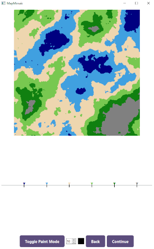
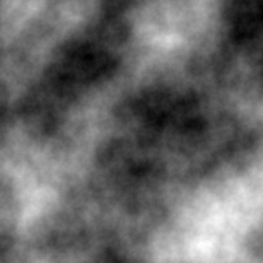
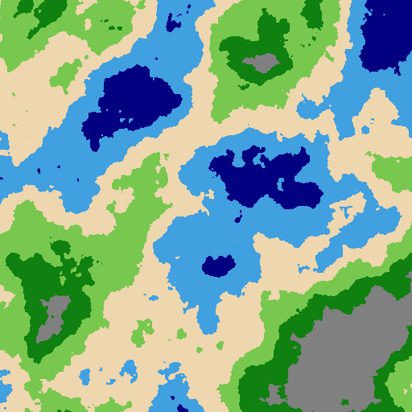
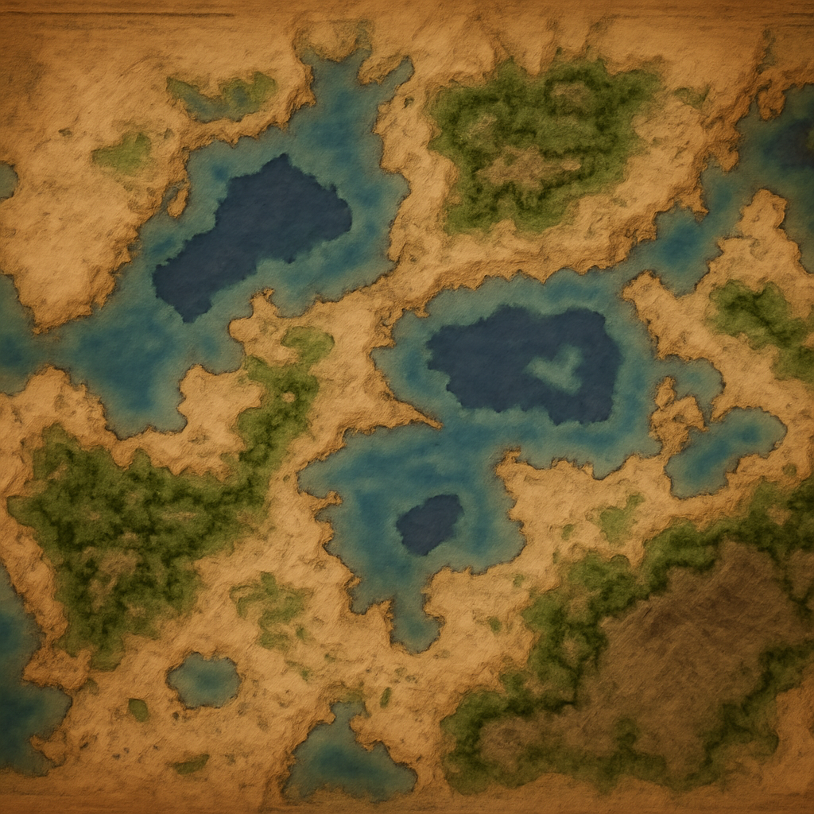

# 🗺️ Map Mosaic

AI-enhanced procedural map generator.Map Mosaic combines classic procedural noise with modern AI generation to craft a cohesive fantasy or real-world map—ideal for video games, tabletop RPGs, storytelling, and visualization.

---

## 🔍 Preview

### Interface



### Sample Maps

<p align="center">
   ➔
   ➔
  
</p>

---

## ✨ Key Features

- 🎲 **Procedural Heightmap Generation**:Generate unique elevation maps with intuitive noise controls and instant preview.
- 🎨 **Color Mapping**: Guide the AI generation with easy-to-use color mappings for different terrain bands.
- 🖌️ **Paint Mode & AI Generation**: Hand-paint details or apply an overall art-style prompt—Map Mosaic will generate the final stylized map in one go using the latest generative AI capabilities.
- 🧰 **Intuitive GUI**: An easy-to-use interface walks you through each step—no steep learning curve.

---

## 🛠️ Installation & Build

### Requirements

- Python 3.10+
- An OpenAI API key (for final map generation)
- `pip`, `venv` (or equivalent)

### Setup

```bash
# Clone the repository
git clone https://github.com/keystoneintelligence/mapmosaic.git
cd MapMosaic

# Create & activate virtual environment
python -m venv venv
source venv/bin/activate    # macOS/Linux
venv\Scripts\activate       # Windows

# Install dependencies
pip install -r requirements.txt

# Launch the app
python main.py
```

---

## 🚧 Roadmap

- Configurable LLM Provider Support
- Improved Noise & Colormap Controls
- Feature Inpainting Support

---

## ❓ FAQ

**How does this tool interact with OpenAI?**
In order to utilize the generative AI capabilites of Map Mosaic you must provide your own OpenAI API Key.

**What resolutions are supported?**
Maps are currently output at 1024×1024 resolution.

**Can I use Map Mosaic commercially?**
Yes—see the LICENSE for details.

---

## 🌐 Links

- [🧩 Map Mosaic Website](https://www.keystoneintelligence.ai/mapmosaic)
- [🕹️ Itch.io Page](https://keystoneintelligence.itch.io/mapmosaic)

---

## 📜 License

Map Mosaic is released under the [GNU General Public License v3.0](LICENSE).

---

## 🤝 Contributing

We welcome contributions! Please see [CONTRIBUTING.md](CONTRIBUTING.md) for guidelines.
